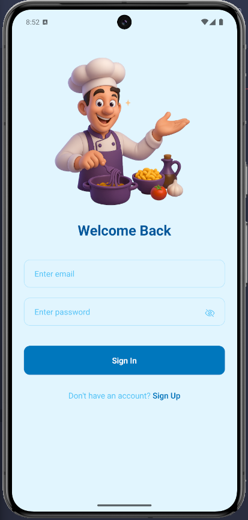
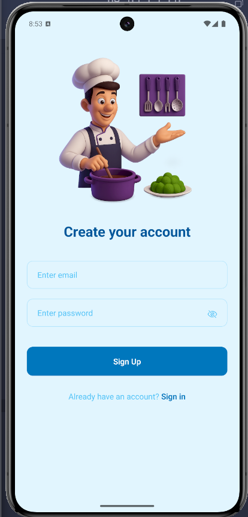
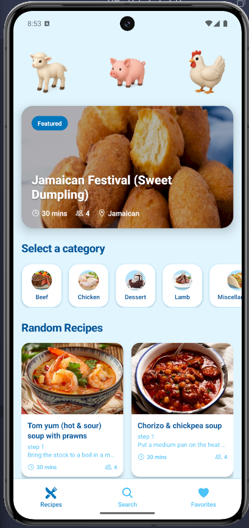
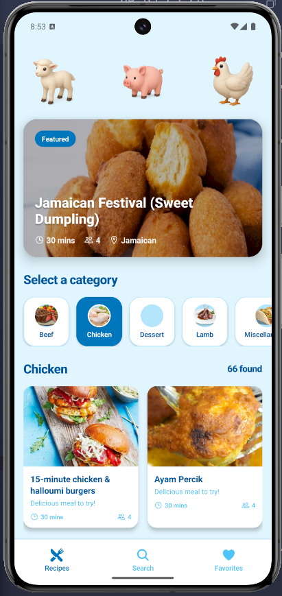
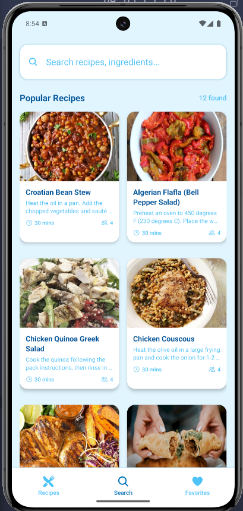
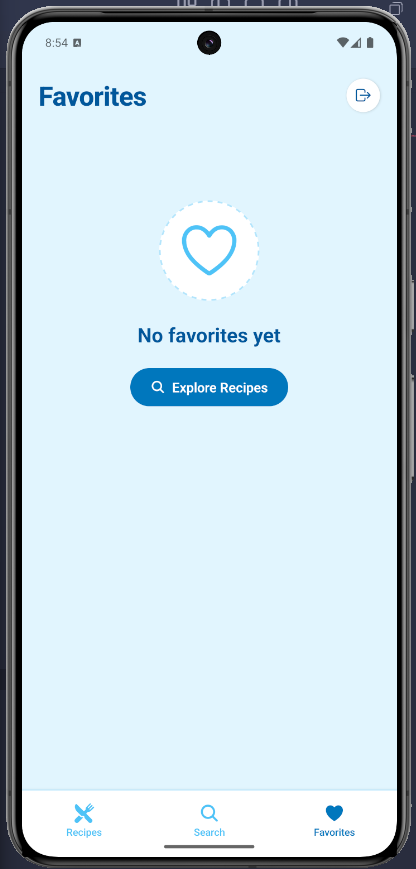
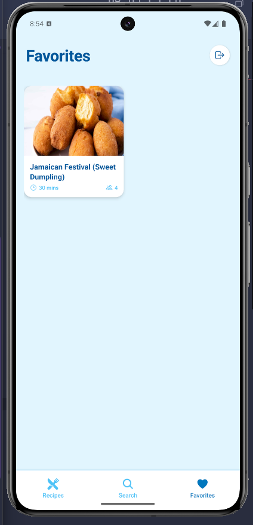
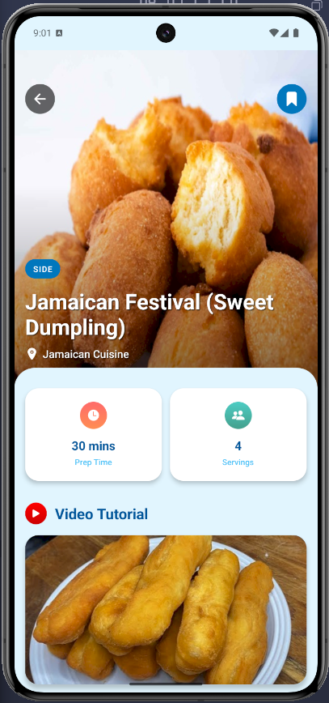

# 🍳 Recipe App

Aplicación móvil de recetas de cocina desarrollada con **React Native** y **Expo**, con autenticación mediante **Clerk** y base de datos en **Neon** utilizando **Drizzle ORM**.

## 🚀 Tecnologías utilizadas
- [React Native](https://reactnative.dev/) + [Expo](https://expo.dev/)  
- [Clerk](https://clerk.com/) para autenticación (login/logout)  
- [Neon](https://neon.tech/) como base de datos Postgres serverless  
- [Drizzle ORM](https://orm.drizzle.team/) para consultas tipadas y migraciones  
- [TypeScript](https://www.typescriptlang.org/) para tipado estático  

## 📱 Funcionalidades principales
La app consta de **6 pantallas**:

1. **Login / Logout**  
   - Autenticación segura con Clerk.  
   - Manejo de sesión y cierre de sesión.  

2. **Home**  
   - Renderiza una receta random como principal.  
   - Muestra 12 recetas random adicionales.  
   - Filtros por categorías.  

3. **Search**  
   - Búsqueda por nombre de receta o ingrediente.  

4. **Favoritos**  
   - Lista de recetas guardadas en la base de datos del usuario.  

5. **Detalle de receta**  
   - Vista completa de la receta seleccionada.  
   - Ingredientes, pasos y opciones para guardar en favoritos.  


## ⚙️ Instalación y ejecución
1. Clonar el repositorio:
   ```bash
   git clone https://github.com/Marianoj1991/recipe-mobile-app
   cd recipe-mobile-app
1. - Abrir dos terminales (una para backend y otra para frontend):
   ```bash
   cd backend
   npm install
   npm run dev
    ```
    ```bash
    cd frontend
    npm install
    npx expo start


## 📸 Capturas de pantalla

### Sign In Screen


### Sign Up Screen


### Home Screen




### Search Screen


### Favorites Screen




### Recipe detail Screen

